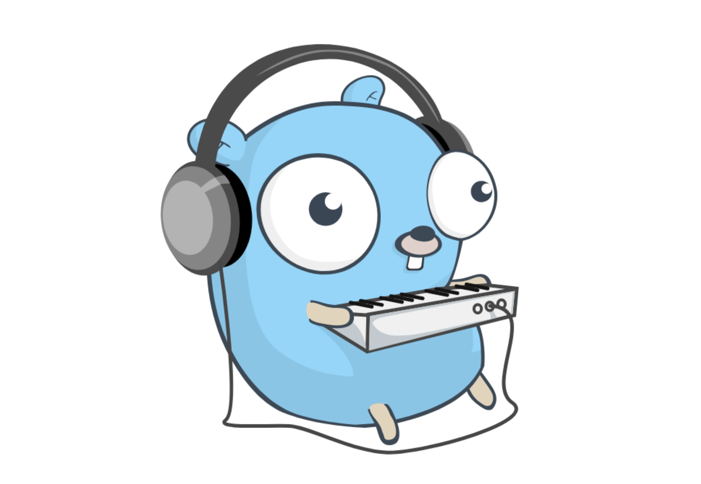

# PlaylistService



## Описание

Тестовое задание для поступления в GoCloudCamp. Реализована имитация плейлиста для работы с объектами Song обладающими свойством Duration. Сервис использует протокол [GRPC](https://grpc.io/), в качестве хранилища для объектов Song выбрана [Postgresql](https://www.postgresql.org/). Для логирования используется библиотека [zap](https://github.com/uber-go/zap). Сервис покрыт юнит-тестами. В тестах активно используются моки, сгенерированные с помощью библиотеки [golang/mock](https://github.com/golang/mock). Сервис построен с учетом требований чистой архитектуры. Параметры для запуска считываются из переменных окружения с помощью библиотеки [caarlos0/env](https://github.com/caarlos0/env). Для контроля за качеством кода настроены параметры [github actions](https://docs.github.com/en/actions), проверяющие код с помощью линтеров [golangci-lint](https://github.com/golangci/golangci-lint) и запускающие тесты при добавлении кода на [github](https://github.com).

### Минимальные требования для запуска сервиса:
- Установленый [docker](https://docs.docker.com/engine/install/)
- Установленный [docker-compose](https://docs.docker.com/compose/install/)
- установленный [git](https://git-scm.com/book/en/v2/Getting-Started-Installing-Git?source=post_page---------------------------)
- установлена утилита [make](https://habr.com/ru/post/211751/)
- для запуска тестов необходима установка языка [Golang](https://go.dev/doc/install)

### Инструкция по запуску:
1. Переходим в папку, в которой планируем разместить файлы с исходным кодом.
2. Клонируем репозиторий, для чего вводим в командную строку команду: 
```bash
git clone https://github.com/sanyarise/PlaylistService.git
```
3. Для запуска тестов вводим в командной строке команду 
```bash
make test
```
4. Для запуска сервиса вводим в командной строке 
```bash
make up
``` 
или, если утилита make не установлена, вводим 
```bash
docker-compose up -d
```
5. После окончания процесса скачивания, создания и запуска необходимых контейнеров нужно запустить тестовый клиент для взаимодействия с сервисом, для этого вводим в командной строке 
```bash
make client
``` 
или, если утилита make не установлена, то 
```bash
go run ./cmd/client/main.go
```
6. После запуска клиента, который представляет собой консольную утилиту, можно ввести команду из списка (create - создание новой песни (при создании нужно будет ввести название композиции и ее длительность), get - получение песни по id, update - изменение песни, delete - удаление песни из базы данных и плейлиста, add - добавление песни в плейлист, play - старт воспроизвдения, pause - приостановка воспроизведения, next - переключение на следующую песню, exit - выход)
7. Для остановки сервиса наберите 
```bash
make down
``` 
или 
```bash
docker-compose down
```
.
8. Если нужно запустить сервис не в режиме контейнера, нужно набрать команду для запуска отдельно контейнера с базой данных:
```bash
make db
```
или если не установлена утилита make, то
```bash
docker-compose up postgres -d
```
. Затем нужно набрать
```bash
make run
```
или 
```bash
go run ./cmd/playlistService/main.go
```
затем запустить сервис по инструкции из 5 шага.
# Видео:

